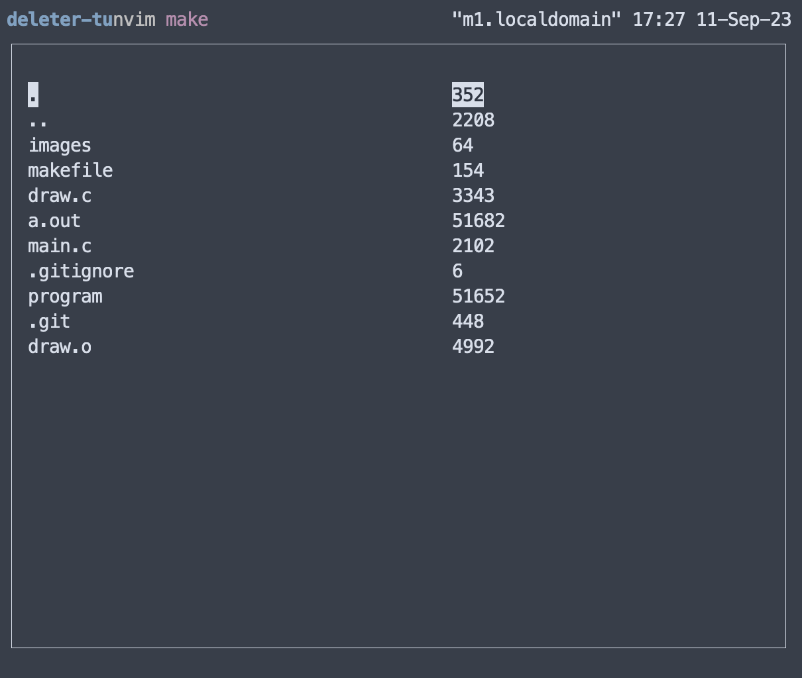

# Deleter-tui

A minimal [ncurses](https://invisible-island.net/ncurses/announce.html) file navigator with
vim-style keybindings that reports recursive file size.

### Todo

~~Migrate to du c implementation~~

- [ ] Rewrite without global variables
- [ ] Reduce memory footprint?
